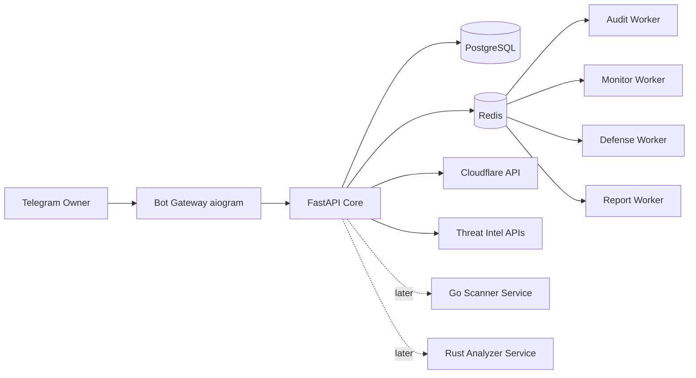
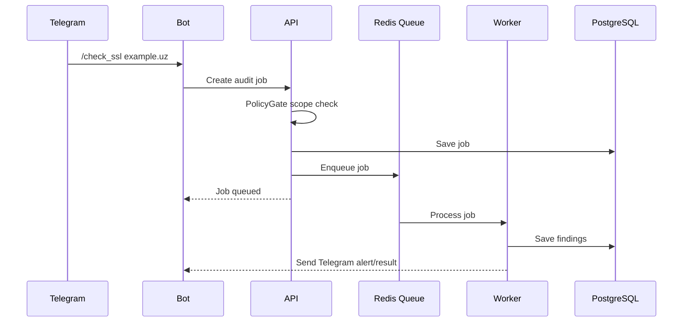

# Architecture — SecPilot Defense

## 1. Arxitektura qarori

Boshlanishda **Modular Monolith** ishlatiladi. Sabab:

- development tez
- deploy oson
- debugging oson
- Telegram bot + FastAPI + workerlar uchun yetarli
- keyinchalik Go/Rust service ajratish oson

Keyingi bosqichda yuklama oshsa:

- port/network scanner → Go microservice
- file/APK/static analyzer → Rust microservice

## 2. Umumiy diagramma

## 3. Komponentlar

| Komponent | Vazifa |
|---|---|
| Bot Gateway | Telegram commandlar, alertlar, owner auth |
| Core API | orchestration, OpenAPI, job lifecycle |
| PostgreSQL | source of truth |
| Redis | queue, cache, locks |
| Audit Worker | SSL, DNS, headers, web audit |
| Monitor Worker | server health, Docker, service check |
| Defense Worker | UFW, Cloudflare, rate limit, block |
| Report Worker | PDF/JSON/TXT report |
| PolicyGate | scope, role, safety, approval |
| AI Agents | triage, report, architecture advice |
| Go Scanner | keyingi bosqichda tez port/network checks |
| Rust Analyzer | keyingi bosqichda file/APK/static analysis |

## 4. Request flow

## 5. Microservicega ajratish qoidalari

### Go service kerak bo‘ladi agar:

- port scan p95 > 10 soniya
- queue depth > 100
- bir vaqtda ko‘p host tekshirilsa
- Python worker socket workload sabab band bo‘lsa

### Rust service kerak bo‘ladi agar:

- file/APK analysis CPU > 80%
- katta fayllar sekin tahlil qilinsa
- entropy/string extraction og‘irlashsa
- binary parsing moduli kerak bo‘lsa

## 6. Failure mode

| Muammo | Tizim reaksiyasi |
|---|---|
| PostgreSQL down | yangi job yaratilmaydi, fail closed |
| Redis down | queue pause, alert yuboriladi |
| Cloudflare API fail | local alert, action retry emas, human review |
| Threat Intel quota tugadi | cached/degraded mode |
| Worker crash | job retry, audit log |
| AI unavailable | manual report fallback |
